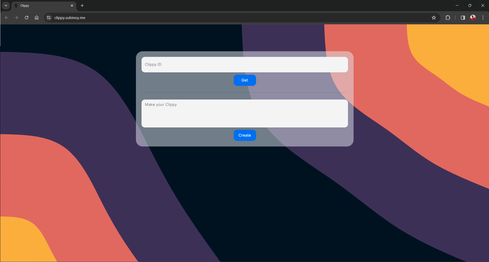
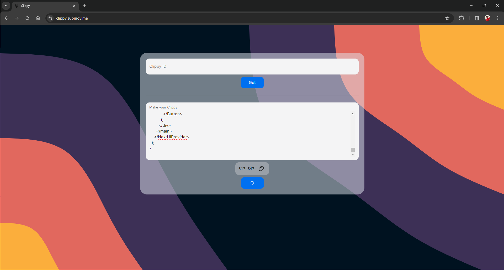

# Clippy📋

Welcome to Clippy, It is an online clipboard tool, to solve the age-old problem of coping and pasting a breeze, it also comes with features like file sharing. Clippy is made with Nextjs and uses MongoDB for storage.

## Usage

Clippy is publically available and hosted on Vercel, you can access Clippy [here](https://clippy.subinoy.me/)

## Screenshots


_Homepage_


_Making a Clippy_

## Features
- Clipboard Management: Easily copy and paste text snippets with Clippy.
- File Sharing: Share files effortlessly using Clippy's file sharing feature.
- Secure Storage: Clippy uses MongoDB for secure storage of your clippings and files.

## Setup Instructions

To get started with this project, follow these steps:

### Installation

 1. Clone this repository:
  ```bash
  git clone <link>
 ```
 2. Navigate to the Project Directory:
 ```bash
 cd <filename>
```

### Install Dependencies:

Install the dependencies using your preferred package manager. For example, if you're using npm:

```bash
npm install
```

### Set Up Environment Variables:

This project requires environment variables for MongoDB connection. Create a .env file in the root directory of the project and add the following variables:

```plaintext
MONGODB_URI=<your_mongodb_uri>
MONGO_DB_NAME=<your_db_name>
MONGO_COLLECTION_NAME=<your_collection_name>
```

### Run the Development Server:

Once you have installed the dependencies and set up the environment variables, you can start the development server by running:

```bash
npm run dev
```

## Contributing
If you'd like to contribute to this project, feel free to open an issue or submit a pull request. Contributions are welcome! , please folloe these steps:
 1. Fork the repository.
 2. Create a new branch for your feature or bug fix.
 3. Make changes and commit them.
 4. Push your changes to your fork.
 5. Create a pull request.

### Contibuting Guidelines 
  We believe in the power of collaboration. If you have ideas to improve College.ai, feel free to contribute! Check out our [Contribution Guidelines]https://github.com/subinoybiswas/clippy/blob/master/CONTRIBUTION.md to get started.


### 📄 Documentation

Explore our comprehensive documentation in the [LEARN.md] file, which serves as a detailed guide to understanding and contributing to Clippy. This document covers various aspects of the project, including setup instructions, architecture overview, and contribution guidelines. We recommend referring to this documentation to gain a deeper insight into UniCollab and make meaningful contributions to its development.

### 🌟 Join Us 

Ready to embark on a journey of collaborative learning? Join Clippy now and be a part of a community that believes in the power of collaboration!
Thank you for contributing to our open-source project! We appreciate your support 🚀
Don't forget to leave a star ⭐
Happy Coding!!❤️


<p align="right">{<a href="#top">Back to top</a>}</p>

